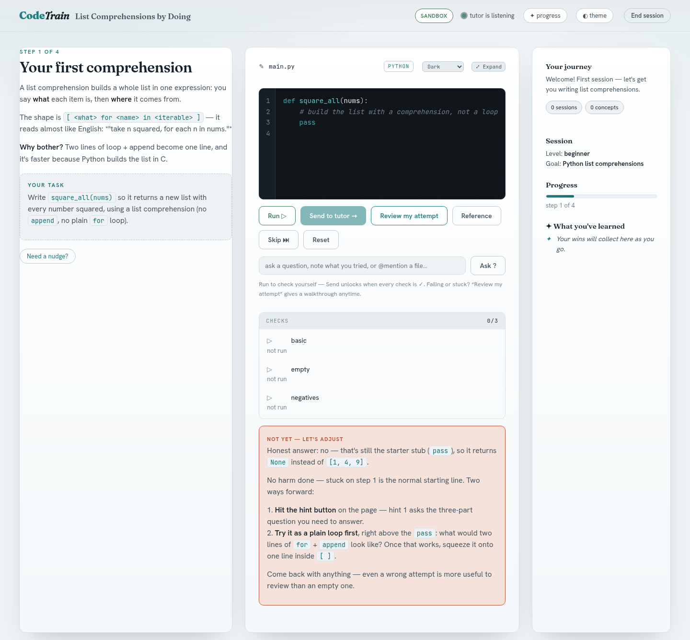

# CodeTrain

CodeTrain is an open-source Socratic coding tutor that runs as an Agent Skill inside your own coding agent. It is free and Apache 2.0 licensed. You write every line of code yourself. The agent sets small steps, gives hints, reviews what you wrote, and never puts the solution into the lesson.

```bash
npx skills add InferHaven/agent-skills
```



*A real lesson page from the OpenCode test run; the lesson text was written by the model that test used.*

## What a lesson looks like

1. The agent starts a small local web page and gives you its link.
2. You choose your level, your goal, and how much guidance you want: minimal, balanced or guided.
3. The agent writes one small step at a time. Each step has a task, hints, and, for Python and JavaScript, test cases.
4. You write the code in the page's editor and press Run. Your code is checked against those tests right in your browser.
5. You press Send. The agent reviews your code, explains, asks a question, and either moves you on or asks you to try again.
6. At the end you get a recap, and your progress is saved on your machine.

Hints climb from a gentle nudge to the shape of the approach. The last hint still never hands you the line to write.

## Who it is for

- Developers who use a coding agent every day and want to keep writing and debugging code themselves.
- Someone learning an unfamiliar codebase. In local code mode you work on your real repository, and edits land in place on your current branch.
- Someone practising a concept. Sandbox mode gives you a throwaway folder under `/tmp` that touches none of your files.
- Someone who wants to understand a diff or pull request, including one an AI wrote. You rewrite each change yourself, starting from the code as it was before.

## Why

When an assistant writes the line, you skip the step that builds the skill. Reading a finished diff is not the same work as producing it, and the producing is the part that sticks.

There is some evidence for this now. Anthropic published a [randomized study](https://www.anthropic.com/research/AI-assistance-coding-skills) on 2026-01-29: 52 software engineers, mostly junior, learned the Python library Trio with or without AI assistance. On a quiz right after the task, the AI group averaged 50% and the hand-coding group 67%. The largest gap was on debugging questions. The AI group finished about two minutes faster, and that difference was not statistically significant. The authors note the sample was small and the quiz measured comprehension shortly after the task, not long-term skill. The study did not test CodeTrain.

## What it will not do

- It does not write your solution into the lesson. Not in the starter code, the feedback, a hint, or an answer to a question you ask on the page, even if you ask for it there. If you want the answer written for you, ask your agent directly in its own chat; that is your choice and it is never refused there.
- Before the page shows the tutor's feedback or a hint, the page itself checks each code span: a span that shares two or more of the step's own names is hidden and shown only behind "Show it anyway". Your own code, the task's wording and a shape with the answer taken out still show. It is a second lock behind the tutor's instructions, not a proof.
- It is not for "just fix it" requests. Your agent handles those directly.
- It has no account and sends nothing to CodeTrain. Your agent sends what it reads to its own model provider, as it does for any task.
- The lesson page's server runs none of your code on your machine, except bash steps in a throwaway container with no network. Python runs in your browser through Pyodide, and JavaScript in a sandboxed browser worker. Your agent may still run a step's check command on your machine, under its normal permission rules.

## Install

You need `python3` (standard library only, nothing to install with pip) and a web browser. Optional: `docker` or `podman` with a small Linux image already present (alpine, busybox, bash, ubuntu or debian) to run bash steps from the page.

Install with the skills CLI:

```bash
npx skills add InferHaven/agent-skills
```

It finds one skill, `codetrain`. A project install puts the skill in `.agents/skills/codetrain` with a link at `.claude/skills/codetrain`. To install it for your user instead of the current project, and to name the agents you use it with:

```bash
npx skills add InferHaven/agent-skills -g
npx skills add InferHaven/agent-skills -g -a claude-code codex opencode
```

Or install by hand:

```bash
git clone https://github.com/InferHaven/agent-skills
cd agent-skills/codetrain
./install.sh
```

Run it again to update.

After installing, restart the agent, then ask in its chat, for example "teach me this code" or "give me a practice exercise on recursion". The agent gives you a local link to the lesson page, at an address that starts with `http://127.0.0.1`.

Optional, Claude Code only: a helper script adds a small, scoped allow-list to `~/.claude/settings.json` so lesson turns stop asking for permission. It lists every rule before writing, removes only the exact rules an older version of itself added and no longer needs, and adds no rule for `~/.codetrain`, so a direct read of the profile asks you first. `--dry-run` writes nothing. `install.sh` offers to run it when started in a terminal:

```bash
python3 ~/.claude/skills/codetrain/app/install-permissions.py
```

## Use

Ask in your agent's chat:

- "teach me this code"
- "walk me through this function"
- "give me a practice exercise on recursion"
- "teach me this diff"
- "drill me"

The agent gives you a local link to the lesson page. Open it and go.

### Two modes

**Local code.** You work on your real repository. Edits land in place on your current branch, and on `main` or `master` the tutor offers a branch first. It never commits for you.

**Sandbox.** A throwaway folder under `/tmp` for practice, touching none of your files.

### Diff and pull request lessons

The tutor can turn a diff into a lesson: your uncommitted changes, a commit, a branch, or a GitHub pull request. You rewrite each change yourself, starting from the code as it was before, and the lesson never shows you the finished lines. A pull request or someone else's commit is done in a throwaway copy.

### Review drills

CodeTrain keeps a small profile in `~/.codetrain/profile.json` and one summary per finished lesson in `~/.codetrain/history/`. At the end of a lesson the agent writes one small file and `ctl.sh profile-update` records it: totals, streak, the review schedule and a history summary. Concepts you struggled with come back for review at widening intervals. Say "drill me" to start a review.

### Checkpoints

Opt-in. During normal work the agent may offer a short hands-on detour when your actual code reaches a teachable moment. It is one line you answer yes or no, never offered mid-debugging, about two per session at most, and not offered again after you decline. It is off until you turn on `app/checkpoint-hook.sh` or add a line to your agent's instructions.

The Agent Skills format itself is an [open specification](https://agentskills.io).

## Which agents does it work in?

The skill is built and tested first on Claude Code, and it follows the open Agent Skills format, so an agent that reads the format can find the skill; whether a lesson works there is what the tests below report. We test it rather than claim it: here is every agent we have run it in, with the exact result.

| Agent | Version | Tested | Model in the test | Lesson started | Woke on Send by itself | Reviewed submitted code | Recorded the lesson |
|---|---|---|---|---|---|---|---|
| Claude Code | 2.1.291 | 2026-10-06 | `claude-opus-5-5` (account default) | yes, from a plain request | yes | yes | yes |
| OpenCode | 1.18.34 | 2026-10-06 | `opencode/big-pickle` (free) | yes, from a plain request | yes | yes | yes |
| Antigravity CLI | 1.3.0 | 2026-10-06 | `gemini-3.8-flash-high` (default) | yes, from a plain request | yes | yes | yes |
| Codex CLI | 0.128.0 | 2026-10-06 | `openai/gpt-5.1-codex-mini` (earlier skill version) | when named, after one "check it" | no | no | not tested |
| Cursor, GitHub Copilot, Gemini CLI | | | | not tested | | | |

Two things to know from those runs. Claude Code wakes the tutor by itself when you press Send, because it runs the waiting step in the background; in an agent that does not wake by itself, type "check it" in the agent's chat after Send. The permission helper mentioned in Install configures Claude Code only.

Antigravity CLI 1.3.0, with its default model, also passed every stage from a plain request.

In OpenCode, allow the folder it asks about: `/tmp/codetrain-*`, where lessons live. You can answer its prompt when it asks, or set `permission.external_directory` in `opencode.json`.

Codex CLI 0.128.0 was tested earlier the same day, with the previous version of the skill and a small model. It started the lesson only when the skill was named, and after one "check it", and it did not review submitted code.

Cursor, GitHub Copilot and Gemini CLI were not tested. The skills CLI can place the skill for many more agents, but placing it is not the same as testing it.

## What leaves your machine

- The lesson page is served on 127.0.0.1 only. The skill sends nothing to CodeTrain or InferHaven: no account, no telemetry, no analytics.
- Your agent sends what it reads to its own model provider, as it does for any task. In a lesson, what the agent reads includes your code and the lesson file. From your profile the agent gets only a short summary, printed by `ctl.sh profile` at the start of the lesson: level, languages, lessons, streak, the last lesson date, the latest goal and the concepts due for review. Strengths, notes, other gaps, older goals and past lesson summaries stay in `~/.codetrain` unless you ask the tutor to use them, and the agent never reads or edits the profile files itself. In the three test runs, marker words planted in a test profile never appeared in the agent's transcript.
- The only other network fetch is Pyodide, downloaded from jsDelivr the first time Python runs. JavaScript runs in a sandboxed browser worker, and bash runs in a throwaway container with no network when docker or podman is available; otherwise you run it in your own terminal and describe what you saw.
- The lesson page's server runs none of your code on your machine except bash steps inside that container. Your agent can still run commands with its own tools, as it can for any task: to check a result it may run the step's check command or your submitted file, under your agent's normal permission rules.
- File writes from the page stay inside the workspace the lesson was started in: your repository in local code mode, the throwaway folder in sandbox mode.

Local files it keeps: a small profile in `~/.codetrain/profile.json` and one summary per finished lesson in `~/.codetrain/history/`. In local code mode it never commits for you.

Optional, Claude Code only: the permission helper adds a small, scoped allow-list to `~/.claude/settings.json` so lesson turns stop asking for permission. It removes only the exact rules an older version of itself added and no longer needs, and it lists them before writing. It adds no rule for `~/.codetrain`, so a direct read of the profile asks you first. `--dry-run` writes nothing.

## The skill, the CLI agent, and CodeTrain in the browser

Three things carry the CodeTrain name and they are not the same product. This repository is the skill: free, Apache 2.0, running inside your own agent. There is also a `codetrain` command-line agent, a free install that is not open source, and the managed tutor at codetrain.ai. The table is the short version.

| | CodeTrain skill (this repository) | `codetrain` CLI agent | CodeTrain in the browser |
|---|---|---|---|
| License or source | Apache 2.0, open source | Not open source, free install | Not open source |
| Where it runs | Inside your own coding agent, on your machine | On your machine, serves its own page on 127.0.0.1 | At codetrain.ai |
| Which model does the tutoring | Your agent's model, billed by whoever already bills that agent | Its own tutor, talking to `api.codetrain.ai` | Managed models |
| Account | None | A CodeTrain account for lessons | A CodeTrain account |
| Cost | Free | Free plan (10 lessons a month, no card) and paid plans | Free plan (10 lessons a month, no card) and paid plans, [prices here](https://codetrain.ai/#pricing) |
| How to start | `npx skills add InferHaven/agent-skills` | `pip install codetrain-cli` | Start free at [codetrain.ai](https://codetrain.ai) |

The skill uses your own agent and model account, has no CodeTrain servers, and is single-player. The hosted plans add managed models with no setup, cross-device profile sync, and team features such as dashboards and onboarding journeys.

## Questions we get

### Does it send my code anywhere?

Your agent sends what it reads to its own model provider, as it does for any task, and in a lesson this includes your code and the lesson file. From your local profile it gets only a short summary; the rest stays in `~/.codetrain`. The skill itself sends nothing to CodeTrain or InferHaven: no account, no telemetry, no analytics. The only other network fetch is Pyodide from jsDelivr, the first time Python runs.

### Is it free? What is the catch?

The skill is free and has no CodeTrain account. It uses your own agent and that agent's model account, so any model usage is billed by whoever already bills that agent: that is the whole catch. CodeTrain also sells hosted plans, but nothing in this repository needs them.

### Does it work in Codex, OpenCode, Antigravity or Cursor?

Tested 2026-10-06: Claude Code 2.1.291, OpenCode 1.18.34 with a free model, and Antigravity CLI 1.3.0 with its default model. In each of the three, a plain request started the lesson and every stage passed without a nudge: the page was served, step 1 was written after the intake, submitted code was reviewed, and the end of the lesson was recorded. OpenCode asks before the agent uses `/tmp/codetrain-*`, where lessons live, so allow it. Codex CLI 0.128.0 was tested earlier the same day with the previous version and a small model: it started only when the skill was named and after one "check it", and it did not review submitted code. In an agent that does not wake by itself, type "check it" in the chat after Send. Cursor, GitHub Copilot and Gemini CLI were not tested.

### Will it ever give me the answer?

No. Not in the starter code, the feedback, a hint, or an answer to a question you ask on the page. There is now a second lock in the page itself: before it shows the tutor's feedback or a hint, it checks each code span, and a span that shares two or more of the step's own names is hidden behind "Show it anyway". It is a check, not a proof. If you want the answer written for you, ask your agent directly in its own chat; that is your choice and it is never refused there.

### Can I use it on my own codebase?

Yes. In local code mode you work on your real repository, edits land in place on your current branch, and on `main` or `master` it offers a branch first. It never commits for you. Sandbox mode is there when you want a throwaway folder under `/tmp` instead.

### How is it different from Claude Code's Learning output style?

Learning style has Claude explain its choices and, while it completes your task, leave a few lines with a real design decision for you to write, marked `TODO(human)`; you switch to it with `/output-style learning`. In a CodeTrain lesson you write every line, and the agent sets the steps, hints and reviews. Learning style is a good fit when the goal is finishing today's task while writing a few decisions yourself; CodeTrain when the goal is a lesson.

### Can it help me learn from code an AI wrote?

Yes. Teach-on-diff turns a diff into a lesson: your uncommitted changes, a commit, a branch, or a GitHub pull request. You rewrite each change yourself, starting from the code as it was before, and the lesson never shows you the finished lines.

### Which languages can I practise?

Python and JavaScript steps run and are checked against test cases right in your browser. Bash runs in the throwaway container when docker or podman is available. Steps in other languages can be written and reviewed, but the page cannot run them; the agent reviews what you wrote.

### How can I keep my skills while using a coding agent every day?

Three built-in ways. Checkpoints, opt-in, let the agent offer a short hands-on detour when your actual code reaches a teachable moment: one line you answer yes or no, never mid-debugging, about two per session at most. Teach-on-diff turns a real diff into a lesson you rewrite yourself. And concepts you struggled with come back for review at widening intervals; say "drill me" to start a review.

### What happens if I take a break mid-lesson?

One wait for your next action lasts about 30 minutes, and the agent re-arms it quietly. After a few waits with no activity the lesson pauses, and the page tells you to say "arm it" to resume.

## How it works

A small Python server, standard library only, serves the lesson page and one JSON state file, `session.json`. The agent changes the lesson by writing small patches that `app/ctl.sh patch` applies. `app/ctl.sh watch` waits for your next action on the page, whether Send, a question or End, and then wakes the agent with your code and your browser test results. At the start of a lesson the agent runs `app/ctl.sh profile`, which prints a short summary of `~/.codetrain`; the agent never reads or edits the profile files itself, and at the end `ctl.sh profile-update` records the lesson. Before the page shows the tutor's feedback or a hint, `app/answer_guard.py` checks each code span, and a span that shares two or more of the step's own names is hidden behind "Show it anyway". The editor uses a bundled copy of Prism for highlighting, with no CDN, and the fonts are self-hosted.

```text
codetrain/
  SKILL.md                        # the tutor's instructions (loaded by your agent)
  README.md                       # this file
  LICENSE, NOTICE                 # Apache-2.0 license text and notices
  install.sh                      # manual install into ~/.claude/skills/codetrain
  references/session-protocol.md  # state schema + the review loop (rarely needed)
  references/spaced-repetition.md # how review drills are scheduled
  references/teach-on-diff.md     # lessons from a diff or pull request
  app/server.py                   # stdlib server: the lesson page + JSON state API
  app/ctl.sh                      # sandbox/serve/watch/stop/patch/run control (allow-listable)
  app/patch.py                    # applies small JSON patches to session.json
  app/profile.py                  # the learner's brief + end-of-lesson update (~/.codetrain)
  app/answer_guard.py             # holds back a line that writes the step out
  app/watch.sh                    # event watcher (wakes the agent on submit/question/end)
  app/checkpoint-hook.sh          # OPTIONAL proactive-checkpoint nudge (off by default)
  app/install-permissions.py      # OPTIONAL scoped allow-list for Claude Code
  app/static/                     # index.html, styles.css, app.js, self-hosted fonts
  app/static/editor.js            # Prism overlay editor (textarea fallback)
  app/static/prism.js             # vendored Prism (highlighting, no CDN)
  app/static/runner.js            # client run dispatcher (timeout, pass/fail)
  app/static/pyodide-worker.js    # Python (WASM) execution worker
  app/static/js-worker.js         # JavaScript sandbox worker
```

## License and third-party parts

The skill is Apache License 2.0. Contributions are accepted under the Developer Certificate of Origin; there is no CLA. Third-party parts: Prism (MIT license) is bundled; Pyodide (Mozilla Public License 2.0) is loaded at run time from jsDelivr and is not redistributed here; three typefaces are bundled under the SIL Open Font License 1.1.

## Links

- Source: [InferHaven/agent-skills](https://github.com/InferHaven/agent-skills), the skill in [codetrain/](https://github.com/InferHaven/agent-skills/tree/main/codetrain)
- Website: [codetrain.ai](https://codetrain.ai)
- Docs page about this skill: [the open-source CodeTrain skill](https://codetrain.ai/docs/open-source-skill/)
- Security and data handling: [codetrain.ai/security](https://codetrain.ai/security)
- The Agent Skills specification: [agentskills.io](https://agentskills.io)
